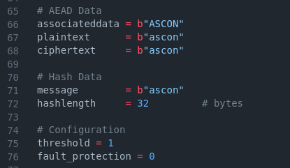

# ASCON Hardware
This repository contains accompanying HDL codes for the paper **Hardware Implementation of ASCON** available in [NIST LWC Workshop 2023](https://csrc.nist.gov/csrc/media/Events/2023/lightweight-cryptography-workshop-2023/documents/accepted-papers/07-hardware-implementation-of-ascon.pdf).

## Contents of the Repository
- Verilog codes for ASCON (HDL)
- SBox implementations for Threshold (sbox)
- Testbench for testing the implementation (testbench)

## Hierarchy of Verilog Modules
- `Ascon` is the top module containing the bit-wise wrapper and unwrapper modules. The unwrapper sends the data to the module `FC`. Source: `hdl/ascon.v`
- `FC` module connects to the subsequent appropriate modules according to the parameters - `TI` and `FA`. If parameter `FA` is set to 1, then the process is triplicated, followed by the majority operation. The respective threshold processes are called if the TI parameter is set to 1. Source: `hdl/fault_countermeasures.v`
- `Encryption_ti`, `Decryption_ti`, `Encryption` and `Decryption` modules, called by the `FA` module, contain the ASCON FSM for encryption and decryption with or without threshold. Source: `hdl/encryption/` and `hdl/decryption/`.
- `Permutation_ti` (for threshold) or `Permutation` and `RoundCounter` modules are called by the encryption and decryption modules. The `Permutation` module contains the ASCON Permutation FSM, and `RoundCounter` is a counter used by the permutation process. Source: `hdl/permutation/` and `hdl/roundcounter.v`.
- `roundconstant`, `sub_layer` and `linear_layer` modules are called from the `Permutation` module, which contains the ASCON round constant layer, substitution layer and linear diffusion layer, respectively. Source: `hdl/permutation/`

## Additional Files
- `Hash` and `Hash_ti` modules contain the ASCON Hash FSM. Source: `hdl/hashing/`
- The proposed SBOXes for Threshold. Source: `ascon_sbox_ti/`

 ## Verifying the Code
We have used `iverilog` verilog compiler and `gtkwave` tool for viewing the waveforms. The testbench directory contains the following testbenches:
- Encryption + Decryption `tb_enc+dec.v`
- Only Encryption `tb_encryption.v`
- Only Decryption `tb_decryption.v`
- Hash `tb_hash.v`

To configure the code, use the `run.py` file. Enter the variant of ASCON and other data in this file. Note that you need not run this file as it is taken care by the makefile.

To make the testing process easier, we have used a Makefile. Here's how you use it:
- Make sure all the files and folders are organised in the same was as in this directory
- Enter `make` into you console to see the list of options
- In addition, you can view the waveforms for debugging purposes using gtkwave by adding `GTK=yes` along with the `make <x>` command.
- You can view the results of the process in the `testcases.txt` file.

Note that you can always manually enter the parameters in `aead_parameters.v` and `hash_parameters.v`. Make sure to comment the `python3 run.py` line in Makefile to use these parameters.

## Example
Here's an example on how to configure the files and verify the code
### Setting Up the Parameters


### Command to run AEAD setup
```bash
make ascon GTK=yes
``` 

### Results


### GTK waveforms

