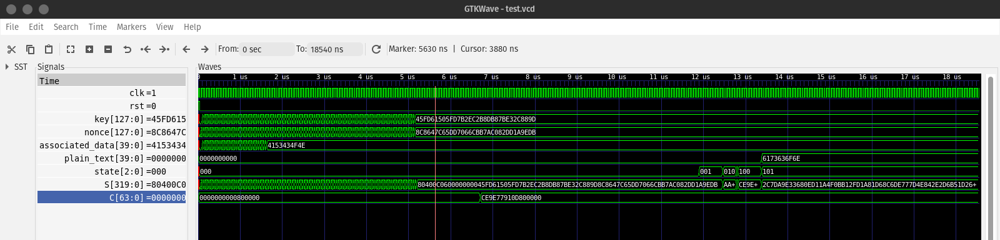

# ASCON Hardware
This repository contains accompanying HDL codes for the paper **Side-channel and Fault Attack Resistant ASCON Implementation: A Detailed Hardware Evaluation** available in [NIST LWC Workshop 2023](https://csrc.nist.gov/csrc/media/Events/2023/lightweight-cryptography-workshop-2023/documents/accepted-papers/07-hardware-implementation-of-ascon.pdf).

## Contents of the Repository
- [Verilog codes for ASCON](https://github.com/aneeshkandi14/ascon-hw-public/tree/main/hdl) (HDL)
- [SBox implementations for Threshold](https://github.com/aneeshkandi14/ascon-hw-public/tree/main/ascon_sbox_ti) (sbox)
- [Testbench for testing the implementation](https://github.com/aneeshkandi14/ascon-hw-public/tree/main/testbench) (testbench)

## Hierarchy of Verilog Modules
The following hierarchy is with respect to the [AEAD](https://github.com/aneeshkandi14/ascon-hw-public/tree/main/hdl/encryption%2Bdecryption) configuration.
- [`Ascon`](https://github.com/aneeshkandi14/ascon-hw-public/blob/main/hdl/encryption%2Bdecryption/ascon.v) is the top module containing the bit-wise wrapper and unwrapper modules. The unwrapper sends the data to the module `FC`.
- [`FC`](https://github.com/aneeshkandi14/ascon-hw-public/blob/main/hdl/encryption%2Bdecryption/fault_countermeasure.v) module connects to the subsequent appropriate modules according to the parameters - `TI` and `FA`. If parameter `FA` is set to 1, then the process is triplicated, followed by the majority operation. The respective threshold processes are called if the TI parameter is set to 1.
- [`Encryption_ti`](https://github.com/aneeshkandi14/ascon-hw-public/blob/main/hdl/encryption%2Bdecryption/ascon_encryption_ti.v), [`Decryption_ti`](https://github.com/aneeshkandi14/ascon-hw-public/blob/main/hdl/encryption%2Bdecryption/ascon_decryption_ti.v), [`Encryption`](https://github.com/aneeshkandi14/ascon-hw-public/blob/main/hdl/encryption%2Bdecryption/ascon_encryption.v) and [`Decryption`](https://github.com/aneeshkandi14/ascon-hw-public/blob/main/hdl/encryption%2Bdecryption/ascon_decryption.v) modules, called by the `FA` module, contain the ASCON FSM for encryption and decryption with or without threshold.
- [`Permutation_ti`](https://github.com/aneeshkandi14/ascon-hw-public/blob/main/hdl/permutation/ascon_permutation_ti.v) (for threshold) or [`Permutation`](https://github.com/aneeshkandi14/ascon-hw-public/blob/main/hdl/permutation/ascon_permutation.v) and [`RoundCounter`](https://github.com/aneeshkandi14/ascon-hw-public/blob/main/hdl/roundcounter.v) modules are called by the encryption and decryption modules. The `Permutation` module contains the ASCON Permutation FSM, and `RoundCounter` is a counter used by the permutation process.
- [`roundconstant`](https://github.com/aneeshkandi14/ascon-hw-public/blob/main/hdl/permutation/roundconstant.v), [`sub_layer`](https://github.com/aneeshkandi14/ascon-hw-public/blob/main/hdl/permutation/substitution_layer.v) and [`linear_layer`](https://github.com/aneeshkandi14/ascon-hw-public/blob/main/hdl/permutation/linear_layer.v) modules are called from the `Permutation` module, which contains the ASCON round constant layer, substitution layer and linear diffusion layer, respectively.

 ## Verifying the Code
We have used `iverilog` verilog compiler and `gtkwave` tool for viewing the waveforms. The testbench directory contains the following testbenches:
- AEAD: [tb_enc+dec.v](https://github.com/aneeshkandi14/ascon-hw-public/blob/main/testbench/tb_enc%2Bdec.v)
- Encryption + Tag Generation: [tb_encryption.v](https://github.com/aneeshkandi14/ascon-hw-public/blob/main/testbench/tb_encryption.v)
- Decryption + Tag Verification: [tb_decryption.v](https://github.com/aneeshkandi14/ascon-hw-public/blob/main/testbench/tb_decryption.v)
- Hash: [tb_hash.v](https://github.com/aneeshkandi14/ascon-hw-public/blob/main/testbench/tb_hash.v)

To configure the code, use the [run.py](https://github.com/aneeshkandi14/ascon-hw-public/blob/main/run.py) file. Enter the variant of ASCON and other data in this file. It may be noted that this file is not needed to run as the task is taken care in the makefile itself.

To make the testing process easier, we have used a Makefile. Here is how it can be used:
- It is inherently assumed that all the files and folders are organised in the same way as in this repository.
- Enter `make` in the console to see the list of options.
- In addition, we can view the waveforms for debugging purposes using gtkwave by adding `GTK=yes` along with the `make <x>` command.
- We can view the results of the process in the [testcases.txt](https://github.com/aneeshkandi14/ascon-hw-public/blob/main/testbench/testcases.txt) file.

It maybe noted that we can also manually enter the parameters in [aead_parameters.v](https://github.com/aneeshkandi14/ascon-hw-public/blob/main/testbench/aead_parameters.v) and [hash_parameters.v](https://github.com/aneeshkandi14/ascon-hw-public/blob/main/testbench/hash_parameters.v). In order to use this option, comment out the `python3 run.py` line in Makefile to use these parameters.

## How-to-run
### Setting Up the Parameters
```python
variant        = "Ascon-128"   # "Ascon-Hash" for hash

# AEAD Data
associateddata = b"ASCON"
plaintext      = b"ascon"
ciphertext     = b"ascon"

# Hash Data
message        = b"hashing hashing hashing hashing!"
hashlength     = 32         # bytes

# Configuration
threshold = 0
fault_protection = 0
```
We can change the variant, associated data, plain text (for AEAD and encryption + tag generation), cipher text (for decryption + tag verification), message (for hash) and countermeasures configuration. If threshold is 0, then no SCA countermeasures are implemented. Similarly, when fault_protection is 0, no fault injection countermeasures are implemented.

### Command to run AEAD setup
```bash
make ascon GTK=yes
``` 

### Results for AEAD
```
VCD info: dumpfile test.vcd opened for output.
Start!
Key:	99b0d3fae7f24b668037c6dbce7f8699
Nonce:	bfab0eb2731a26c6c44903bc6a54fe12
AD:	4153434f4e
PT:	6173636f6e
Encryption + Tag Generation Done! It took         39 clock cycles
CT:	9620e3e301
Tag:	ba200d2dd371d936101d374f8fe06a39
Decryption + Tag Verification Done! It took         38 clock cycles
PT:	6173636f6e
Tag:	ba200d2dd371d936101d374f8fe06a39
Is message authenticated?:	1
```

### Command to run Hash setup
```bash
make hash
``` 

### Results for Hash
```
VCD info: dumpfile test.vcd opened for output.
Start!
Message:	68617368696e672068617368696e672068617368696e672068617368696e6721
Hashing Done! It took        130 clock cycles
Hash:	8c85e97381008fd424b1db330b9eb65c70bec62531fae7dbde61af3a4dca07bb
```

### Simulation waveform (GTK)

